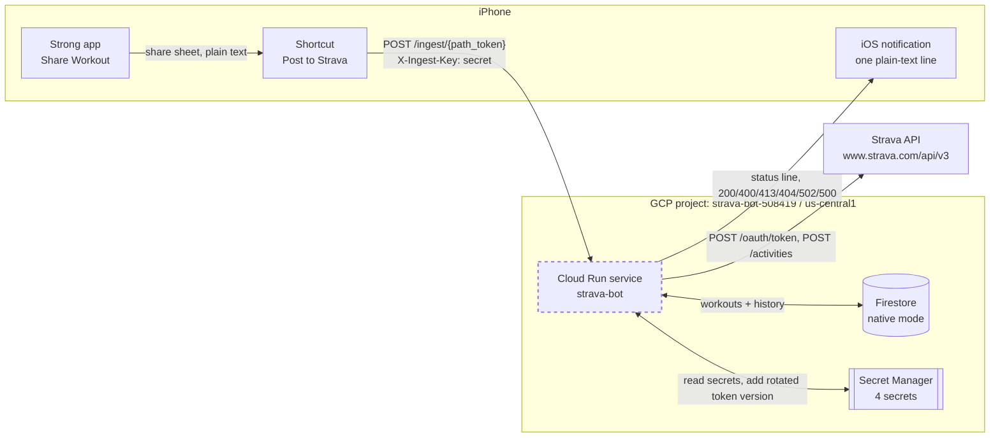
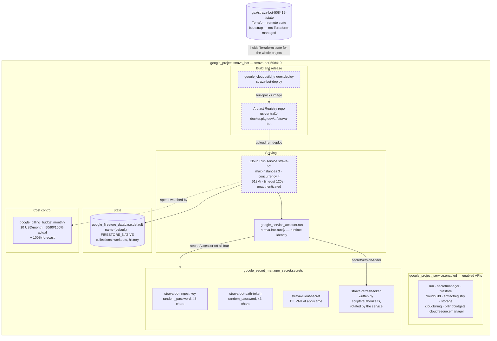
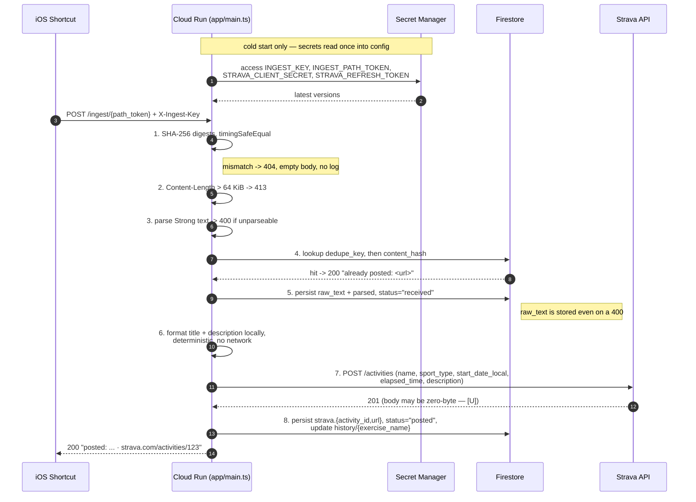
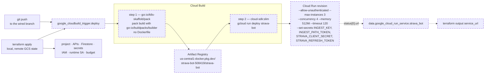
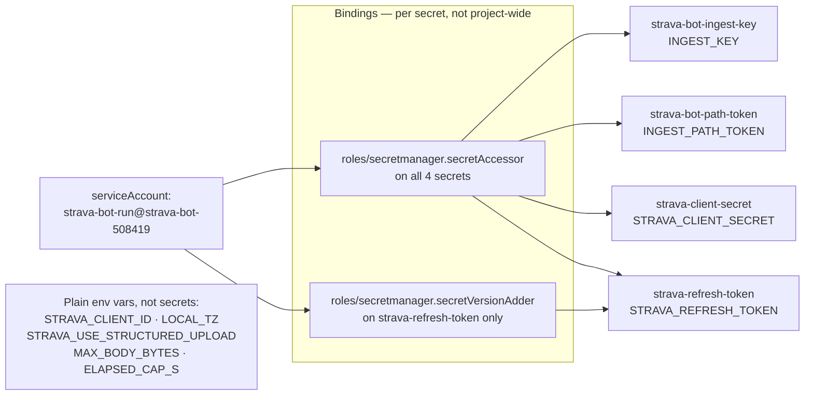
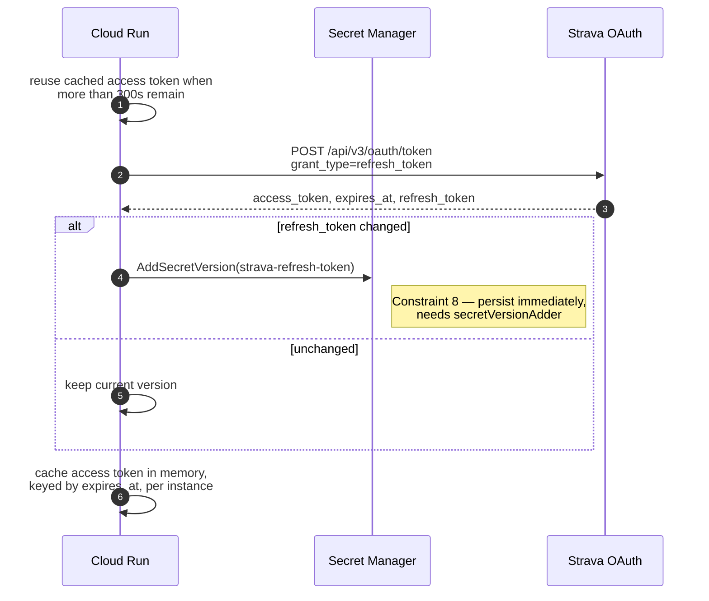
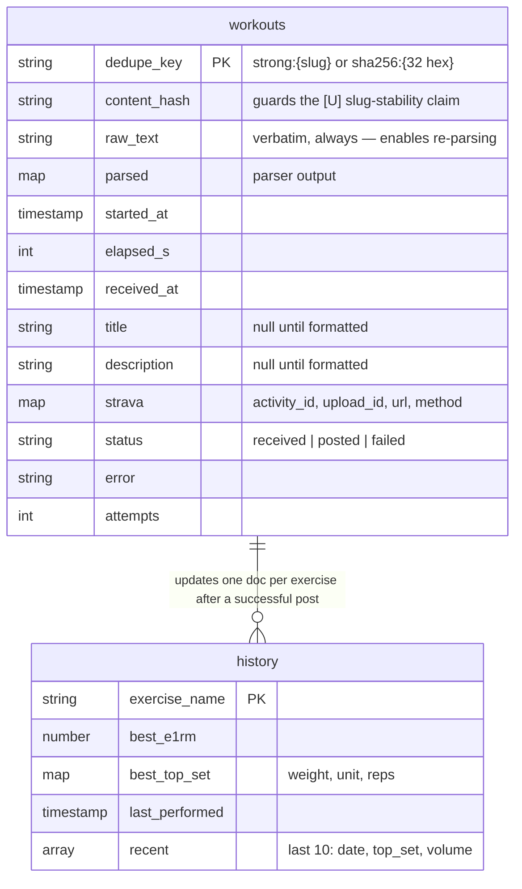
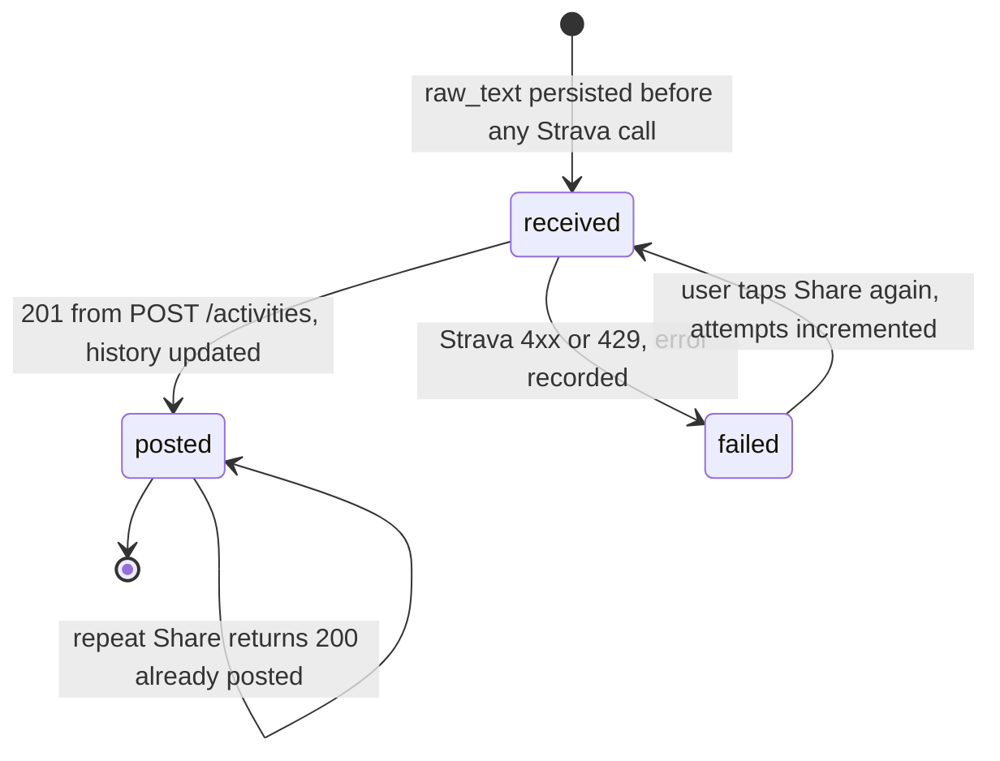
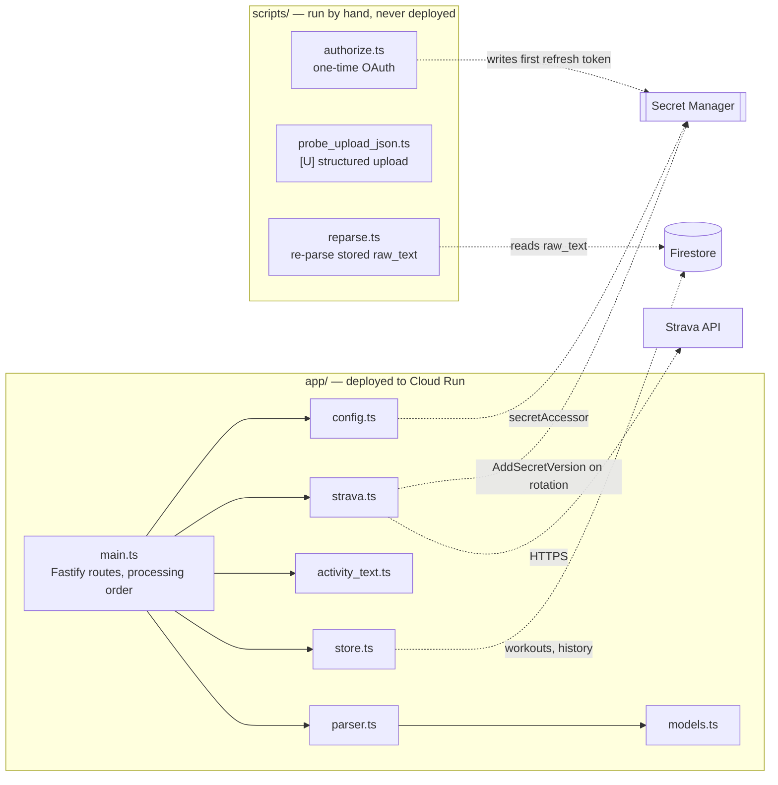

# Architecture

How the Strava Bot service is put together, with an emphasis on the **GCP resources** that carry it. This is a map, not a spec: the authoritative behaviour lives in [docs/PLANNING.md](docs/PLANNING.md) and the non-negotiables in [docs/CONSTRAINTS.md](docs/CONSTRAINTS.md). Every resource below is declared in [`terraform/`](terraform/) except the Cloud Run service, which the Cloud Build pipeline deploys ([ADR 0007](docs/decisions/0007-terraform-for-gcp-infra.md)).

- **Project:** `strava-bot-508419` · **Region:** `us-central1` · **Runtime:** Node.js 24 LTS, strict TypeScript ([ADR 0008](docs/decisions/0008-typescript-node-runtime.md))
- **Shape:** one public HTTPS endpoint, one Firestore database, four secrets, one user. No queues, no schedulers, no retry infrastructure.

Diagram legend: solid = applied today; **dashed = declared but not yet deployed** (the Cloud Build trigger and the Cloud Run service land in [T19](docs/tasks/T19-cloud-run-deploy.md); see [docs/STATUS.md](docs/STATUS.md)).

---

## 1. System context

A single user taps Share in Strong, an iOS Shortcut POSTs the raw share text, and one Cloud Run container turns it into a Strava activity.

The Shortcut has no crypto primitives, so it cannot mint an OIDC token — the endpoint is unauthenticated at the Cloud Run IAM layer and authenticated in the application by a static bearer secret plus a secret URL path segment ([ADR 0001](docs/decisions/0001-static-bearer-secret.md)).

---

## 2. GCP resource map

Everything the project contains, grouped by the job it does.

| Terraform address | GCP resource | Why it exists |
| --- | --- | --- |
| `google_project.strava_bot` | Project `strava-bot-508419` | Blast-radius boundary; imported, not created |
| `google_project_service.enabled` | 9 enabled APIs | API enablement stays in Terraform, never the Console |
| `google_firestore_database.default` | Firestore, native mode | Dedupe/idempotency + rolling per-exercise history ([§6](docs/planning/04-persistence.md)) |
| `google_service_account.run` | `strava-bot-run@` | Cloud Run runtime identity, Secret Manager roles only |
| `google_secret_manager_secret.secrets` | 4 secrets | Every Secret-Manager-sourced row of [§9](docs/planning/07-config-and-repo-layout.md#9-configuration) |
| `google_secret_manager_secret_iam_member.accessor` | IAM | Service reads all four at startup |
| `google_secret_manager_secret_iam_member.version_adder` | IAM | Refresh-token rotation write-back ([Constraint 8](docs/CONSTRAINTS.md)) |
| `google_billing_budget.monthly` | Billing budget | Mandatory pair to `--max-instances=3` ([Constraint 13](docs/CONSTRAINTS.md)) |
| `google_cloudbuild_trigger.deploy` | Cloud Build trigger | Builds with buildpacks, deploys Cloud Run ([T19](docs/tasks/T19-cloud-run-deploy.md)) |
| *(none — `data` source only)* | Cloud Run service | Owned by the pipeline; Terraform reads the URL back |
| *(none — bootstrap)* | GCS state bucket | Must exist before the state that would record it |

---

## 3. Request path

The processing order is mandatory: cheap rejections precede external writes ([Constraint 4](docs/CONSTRAINTS.md)).

Failure behaviour, condensed from [§11](docs/planning/08-error-handling.md):

| Condition | Response | GCP-visible effect |
| --- | --- | --- |
| Bad path token or key | 404, empty body | Counter only — never log the supplied values |
| Body > 64 KiB | 413 | Rejected before the body is read |
| Unparseable | 400 | Firestore doc still written with `raw_text` |
| Duplicate | 200 + existing URL | No Strava call, no formatting |
| Strava 401 | refresh once, retry once, then 502 | New Secret Manager version if the token rotated |
| Strava 429 / other 4xx | 502 | `status="failed"`, rate-limit headers logged |
| Firestore unavailable | 500 | **No Strava post without a durable idempotency record** |

There is no dead-letter queue and no background retry ([ADR 0006](docs/decisions/0006-no-retry-queue.md)) — tapping Share again is idempotent by construction.

---

## 4. Build and release pipeline

Terraform declares the pipeline; the pipeline owns the Cloud Run service. `gcloud` never runs on a developer machine to mutate anything.

Two rules make this split work:

1. **Terraform owns everything except the service.** Because Cloud Build creates and updates the Cloud Run service, Terraform reads its URL back through a `data` source instead of fighting the pipeline over ownership.
2. **The non-negotiable flags live in the deploy step.** `--max-instances=3` is a cost control on a public endpoint, not a performance knob ([Constraint 13](docs/CONSTRAINTS.md)).

---

## 5. Identity, IAM and secrets

The runtime service account holds Secret Manager roles and nothing else. Nothing is granted for Strava, because Strava auth is an application-level bearer token rather than a Google identity. Note that no Firestore role is declared for `strava-bot-run@` in `terraform/` today — `roles/datastore.user` has to be added before the deployed service can read or write `workouts` and `history` ([T13](docs/tasks/T13-store-workouts.md), [T19](docs/tasks/T19-cloud-run-deploy.md)).

**Refresh-token rotation** is the one place the service writes to Secret Manager. Strava access tokens live 6 hours, so the service refreshes on essentially every invocation, and the response's `refresh_token` may differ from the one sent. Dropping a rotated token locks the integration out permanently and forces a manual re-authorization.

The in-memory token cache is per-instance and deliberately not shared — with `--max-instances=3` and roughly five requests a week, a shared cache would be infrastructure bought for nothing.

---

## 6. Data model

One Firestore database in native mode, two collections, no indexes beyond the defaults plus a `content_hash` lookup.

The `content_hash` column exists because rule 1 of the dedupe key rests on an unverified claim — that Strong's share slug is stable across repeated shares. Hashing the content as well makes correctness independent of that claim ([ADR 0003](docs/decisions/0003-content-hash-dedupe-guard.md)).

---

## 7. Cost and abuse posture

The endpoint is public at the IAM layer by necessity, so the controls are layered rather than perimeter-based:

| Layer | Control | Resource |
| --- | --- | --- |
| Network | HTTPS only, Google-managed cert | Cloud Run default |
| URL | secret 43-char path segment | `strava-bot-path-token` |
| Header | `X-Ingest-Key`, constant-time digest compare | `strava-bot-ingest-key` |
| Size | 64 KiB cap before the body is read | `MAX_BODY_BYTES` |
| Compute | `--max-instances=3`, `--concurrency=4`, scale to zero | deploy step |
| Spend | 10 USD/month budget, alerts at 50/90/100% actual + 100% forecast | `google_billing_budget.monthly` |
| Blast radius | one Strava account, `activity:write` scope | Strava app config |

Expected volume is about five requests a week, so Strava's rate limits (200 per 15 min, 2,000 per day) are never in play — the usage headers are logged only because a runaway loop shows up there first.

---

## 8. Deliberately absent

Architecture is as much about what is not here. None of the following exists, and nothing should be built toward it:

- **No AI component anywhere in the MVP** — no SDK, no model call, no prompt, no credential. Strava API Policy §5.3 forbids Strava data in connection with any AI application, and the absence of an AI component is the entire compliance story ([Constraint 1](docs/CONSTRAINTS.md)).
- **No Pub/Sub, Cloud Tasks, Cloud Scheduler, or retry queue** — retries are the user tapping Share again ([ADR 0006](docs/decisions/0006-no-retry-queue.md)).
- **No Cloud Load Balancer, Cloud Armor, VPC, or Serverless VPC connector** — a single public Cloud Run URL is the whole surface.
- **No Dockerfile** — Google's native buildpacks build the image ([§10](docs/planning/07-config-and-repo-layout.md#10-repository-layout)).
- **No user table, no multi-tenancy, no media storage** — Strava's API has no media endpoint, and there is exactly one user ([§1](docs/planning/01-purpose-and-prerequisites.md)).
- **No `gcloud` mutations from a laptop and no Console clicks** — the sole exception is the bootstrap state bucket ([ADR 0007](docs/decisions/0007-terraform-for-gcp-infra.md)).

---

## 9. Code to resource mapping

Infrastructure lives in [`terraform/main.tf`](terraform/main.tf) — project, APIs, Firestore, secrets, IAM, runtime service account, budget, and (at [T19](docs/tasks/T19-cloud-run-deploy.md)) the Cloud Build trigger.

---

← [README](README.md) · [Spec index](docs/PLANNING.md) · [Constraints](docs/CONSTRAINTS.md) · [Decisions](docs/decisions/README.md)
