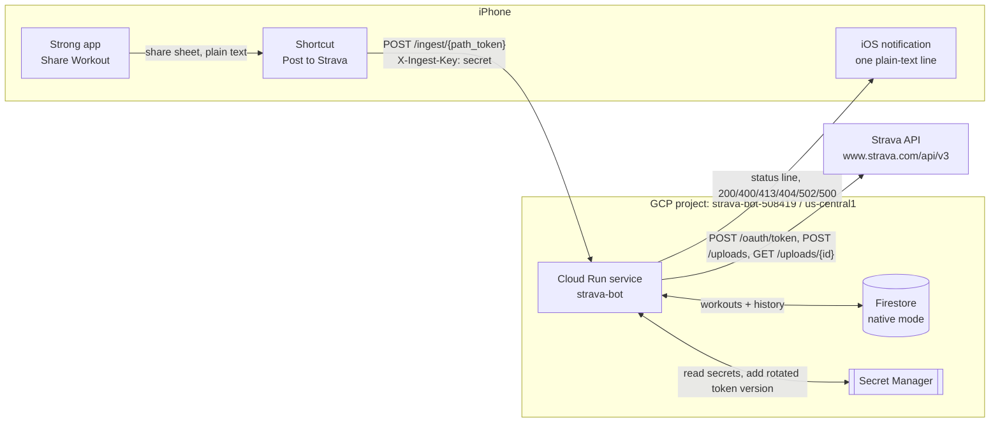
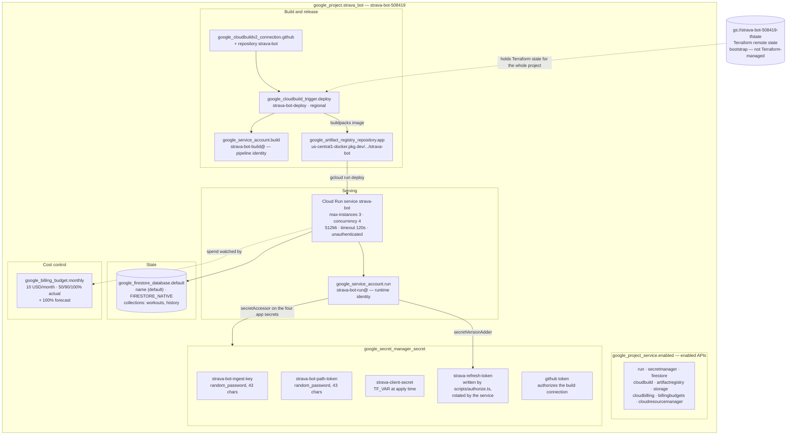
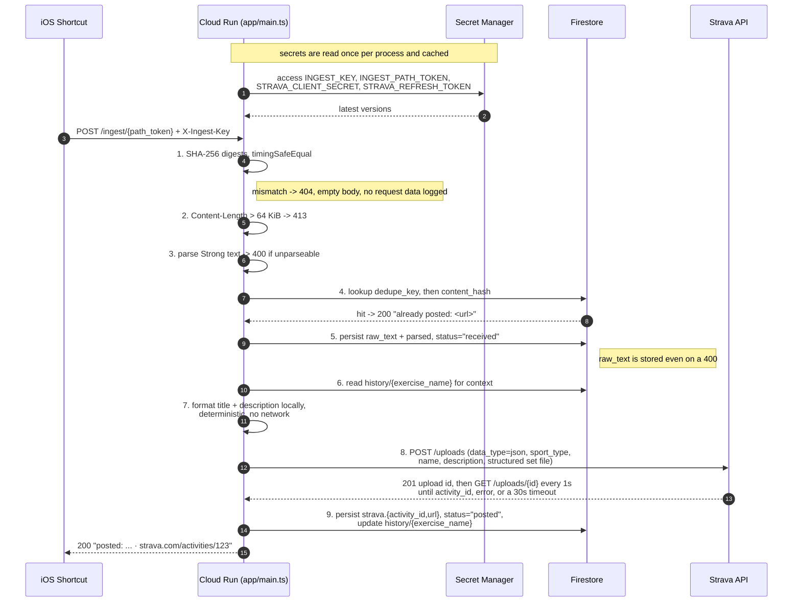
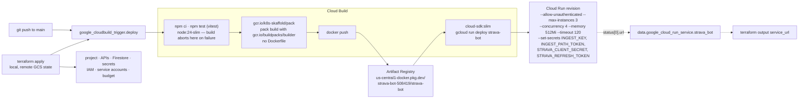
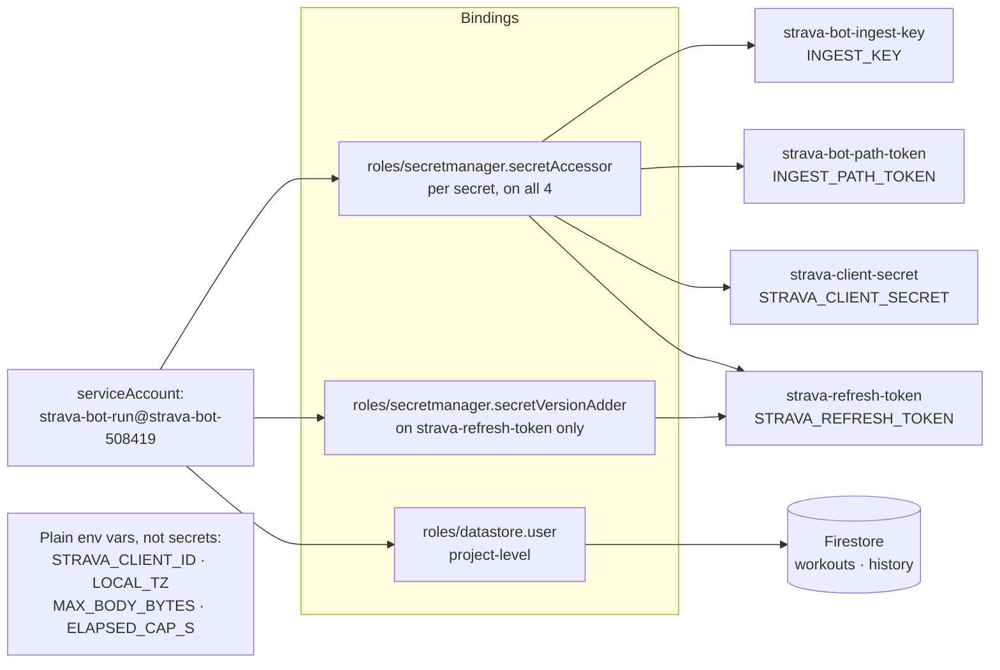
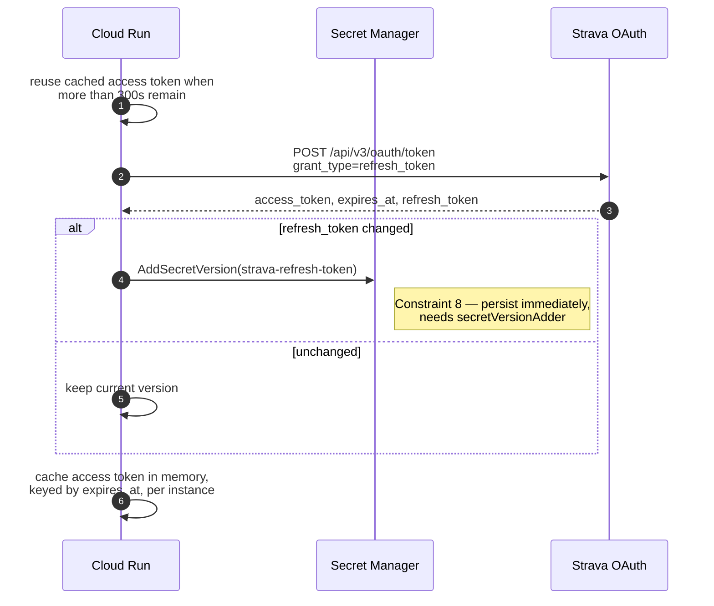
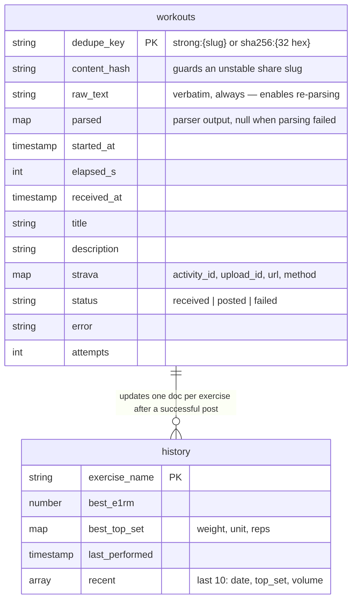
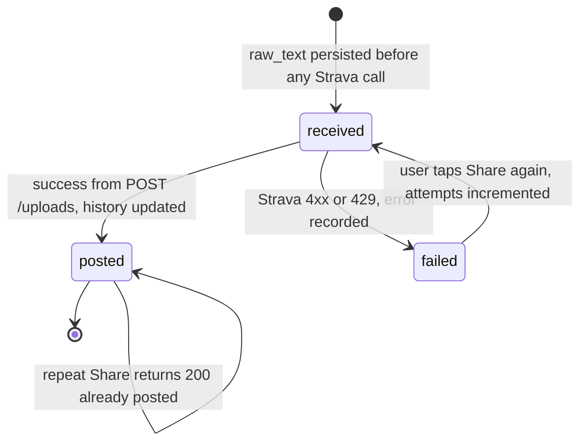
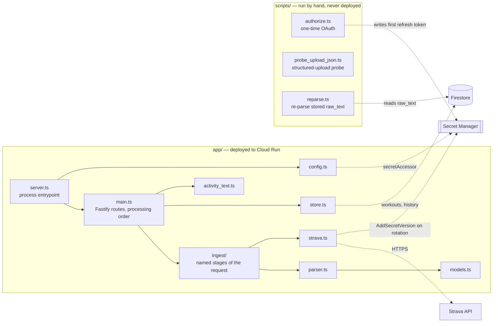

# Architecture

How the Strava Bot service is put together, with an emphasis on the **GCP resources** that carry it. This is a map: behaviour is specified in [reference/](README.md#map) and the non-negotiables in [CONSTRAINTS.md](CONSTRAINTS.md). Every resource below is declared in [`terraform/`](../terraform/) except the Cloud Run service, which the Cloud Build pipeline deploys ([ADR 0007](decisions/0007-terraform-for-gcp-infra.md)).

- **Project:** `strava-bot-508419` · **Region:** `us-central1` · **Runtime:** Node.js 24 LTS, strict TypeScript ([ADR 0008](decisions/0008-typescript-node-runtime.md))
- **Shape:** one public HTTPS endpoint, one Firestore database, five secrets, one user. No queues, no schedulers, no retry infrastructure.

---

## 1. System context

A single user taps Share in Strong, an iOS Shortcut POSTs the raw share text, and one Cloud Run container turns it into a Strava activity.

The Shortcut has no crypto primitives, so it cannot mint an OIDC token — the endpoint is unauthenticated at the Cloud Run IAM layer and authenticated in the application by a static bearer secret plus a secret URL path segment ([ADR 0001](decisions/0001-static-bearer-secret.md)).

---

## 2. GCP resource map

Everything the project contains, grouped by the job it does.

| Terraform address | GCP resource | Why it exists |
| --- | --- | --- |
| `google_project.strava_bot` | Project `strava-bot-508419` | Blast-radius boundary; imported, not created |
| `google_project_service.enabled` | Enabled APIs | API enablement stays in Terraform, never the Console |
| `google_firestore_database.default` | Firestore, native mode | Dedupe/idempotency and rolling per-exercise history ([persistence](reference/persistence.md)) |
| `google_service_account.run` | `strava-bot-run@` | Cloud Run runtime identity |
| `google_secret_manager_secret.secrets` | The four app secrets | Every Secret-Manager-sourced row of [configuration](reference/configuration.md#configuration) |
| `google_secret_manager_secret_iam_member.accessor` | IAM | Service reads all four at startup |
| `google_secret_manager_secret_iam_member.version_adder` | IAM | Refresh-token rotation write-back ([Constraint 8](CONSTRAINTS.md)) |
| `google_project_iam_member.run_firestore` | `roles/datastore.user` | Every request reads and writes Firestore; without it the service answers only `/health` |
| `google_billing_budget.monthly` | Billing budget | Mandatory pair to `--max-instances=3` ([Constraint 13](CONSTRAINTS.md)) |
| `google_artifact_registry_repository.app` | Artifact Registry repo | Buildpacks have no implicit registry, so the destination must exist first |
| `google_service_account.build` | `strava-bot-build@` | Pipeline identity, kept separate from the identity holding the Strava secrets |
| `google_cloudbuildv2_connection.github` | Build connection + repository | The repo is private, so the trigger cannot clone it anonymously |
| `google_cloudbuild_trigger.deploy` | Cloud Build trigger | Unit tests gate the buildpacks build and the Cloud Run deploy |
| *(none — `data` source only)* | Cloud Run service | Owned by the pipeline; Terraform reads the URL back |
| *(none — bootstrap)* | GCS state bucket | Must exist before the state that would record it |

---

## 3. Request path

The processing order is mandatory: cheap rejections precede external writes ([Constraint 4](CONSTRAINTS.md)).

Failure behaviour, condensed from [ingest-api](reference/ingest-api.md#error-handling):

| Condition | Response | GCP-visible effect |
| --- | --- | --- |
| Bad path token or key | 404, empty body | Bare status counter — never log the supplied values |
| Body > 64 KiB | 413 | Rejected before the body is read |
| Unparseable | 400 | Firestore doc still written with `raw_text` |
| Duplicate | 200 + existing URL | No Strava call, no formatting |
| Strava 401 | refresh once, retry once, then 502 | New Secret Manager version if the token rotated |
| Strava 429 / other 4xx | 502 | `status="failed"`, rate-limit headers logged |
| Firestore unavailable | 500 | **No Strava post without a durable idempotency record** |

There is no dead-letter queue and no background retry ([ADR 0006](decisions/0006-no-retry-queue.md)) — tapping Share again is idempotent by construction.

---

## 4. Build and release pipeline

Terraform declares the pipeline; the pipeline owns the Cloud Run service. `gcloud` never runs on a developer machine to mutate anything.

Three rules make this split work:

1. **Terraform owns everything except the service.** Because Cloud Build creates and updates the Cloud Run service, Terraform reads its URL back through a `data` source instead of fighting the pipeline over ownership.
2. **The non-negotiable flags live in the deploy step.** `--max-instances=3` is a cost control on a public endpoint, not a performance knob ([Constraint 13](CONSTRAINTS.md)).
3. **Tests gate the deploy.** The first two steps run `npm ci` and `npm test` on the pushed commit, and Cloud Build aborts on the first failed step — a red suite never reaches the image build, let alone Cloud Run.

Full step list and the reasoning behind the explicit `docker push` are in [operations](operations.md#the-deploy-pipeline).

---

## 5. Identity, IAM and secrets

The runtime service account holds Secret Manager roles plus `roles/datastore.user`, and nothing else. Nothing is granted for Strava, because Strava auth is an application-level bearer token rather than a Google identity.

**Refresh-token rotation** is the one place the service writes to Secret Manager. Strava access tokens live 6 hours, so the service refreshes on essentially every invocation, and the response's `refresh_token` may differ from the one sent. Dropping a rotated token locks the integration out permanently and forces a manual re-authorization.

After a 401 the client re-reads `strava-refresh-token` from Secret Manager, bypassing its cache, so an instance holding a token another instance has already superseded recovers without being replaced. The in-memory token cache is per-instance and deliberately not shared — with `--max-instances=3` and roughly five requests a week, a shared cache would be infrastructure bought for nothing.

---

## 6. Data model

One Firestore database in native mode, two collections, no indexes beyond the defaults plus a `content_hash` lookup.

The `content_hash` field exists because rule 1 of the dedupe key rests on the unverified assumption that Strong's share slug is stable across repeated shares. Hashing the content as well makes correctness independent of it ([ADR 0003](decisions/0003-content-hash-dedupe-guard.md)).

---

## 7. Code to resource mapping

Infrastructure lives in [`terraform/main.tf`](../terraform/main.tf) — project, APIs, Firestore, secrets, IAM, service accounts, budget, the GitHub build connection, and the Cloud Build trigger.

---

← [Docs index](README.md) · [Constraints](CONSTRAINTS.md) · [Decisions](decisions/README.md)
